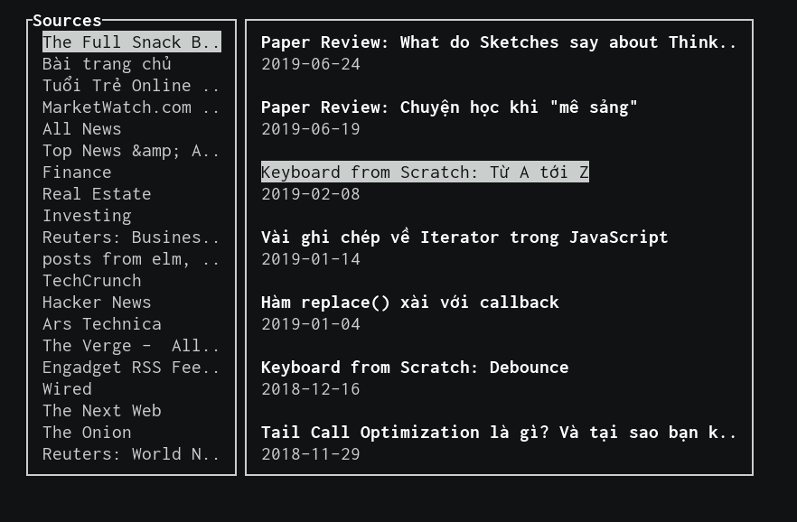
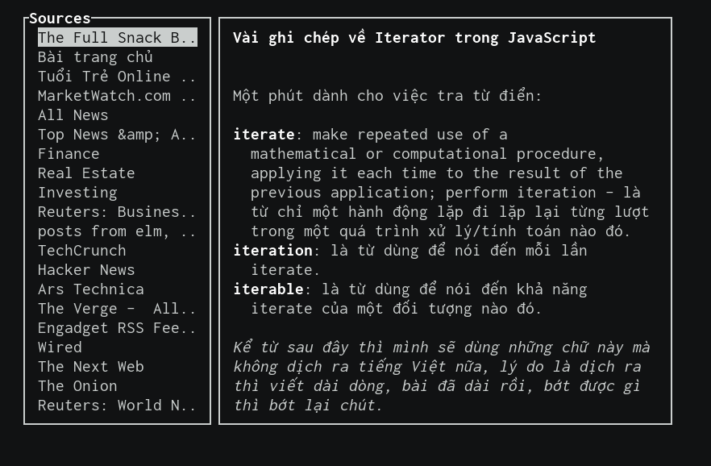

# RSN

_A TUI-based RSS reader written in Rust_

## But why?

Have you ever wonder what will happen when an experienced JS/TS developer gives up all love and hope, trying to understand how the rust borrow checker works and failed pathetically? This is what he will produce.

## But why not web?

There's already a [web version](https://github.com/huytd/snacky-news-rs) from [@huytd](https://github.com/huytd).

## Installation?

1. Clone this repo
2. Build this repo
3. Run it like every other rust executable
4. Duh!

## How to use it?

After you run it, it will show you an empty workspace. These are the keybindings that you need to know to with it. These are the keybinding for the main app

| Key | What it does                 |
| --- | ---------------------------- |
| i   | Add a new rss source         |
| l   | Set focus to the source list |
| f   | Set focus to the feed area   |

Remember, when you focus on a certain part of the app, the control is passed to that part and there will be different keybindings for you to use to manipulate that certain part. Here're the parts of RSN:

```
┌───────────────┐──────────────────────────────┐
│  Source list  │   Feed / Article view area   │
│               │                              │
│               │                              │
│               │                              │
│               │                              │
│               │                              │
│               │                              │
│               │                              │
└───────────────┘──────────────────────────────┘
```

**Source list**

Keybindings for working with source list

| Key        | What it does                                            |
| ---------- | ------------------------------------------------------- |
| UP_ARROW   | Select the source above the current source              |
| DOWN_ARROW | Opposite to the UP_ARROW function                       |
| ENTER      | Display all the article from source and focus feed area |
| d          | Remove selected source from list                        |
| q          | Pass control to the main app                            |

**Feed area**

Keybindings for working with feed area

| Key        | What it does                                    |
| ---------- | ----------------------------------------------- |
| UP_ARROW   | Select the article above the current article    |
| DOWN_ARROW | Opposite to the UP_ARROW function               |
| ENTER      | Display the article and focus article view area |
| q          | Pass control to the main app                    |

**Feed area**

Keybindings for working with feed area

| Key        | What it does                      |
| ---------- | --------------------------------- |
| UP_ARROW   | Scroll article up                 |
| DOWN_ARROW | Opposite to the UP_ARROW function |
| q          | Pass control to the main app      |

## Screenshot





## Bonus

Beside of this awesome app, I also provide you with a sample list of news for you to read in case you're a lazy guy like me.

Just copy the `user_data_sample.json` file to `$home/.rsn/user_data.json`.

> \$home is your home directory

## Todo

- [ ] Allow rename source
- [ ] Allow re-url source
- [x] ~~Open article in browser~~

## Author

- [Viet Hung Nguyen](https://github.com/ZeroX-DG)

<a href="https://www.buymeacoffee.com/hQteV8A" target="_blank"></a>

## License

- [MIT](LICENSE)
